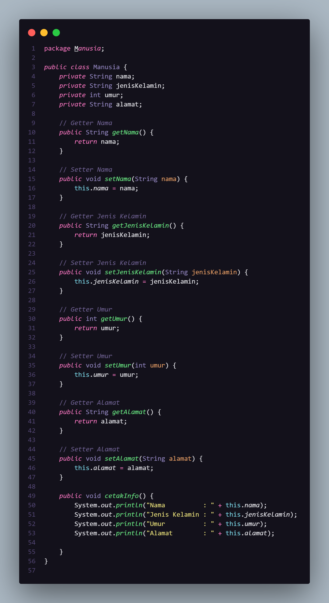

# Praktikum 3

| Keterangan | Data                |
| ---------- | ------------------- | ------------ |
| **Nama**   | Eky Fikri Yamansyah |
| **NIM**    | 312310572           |
| **Kelas**  | TI.23.A6            | # Praktikum2 |

| Keterangan | Data                |
| ---------- | ------------------- |
| **Nama**   | Eky Fikri Yamansyah |
| **NIM**    | 312310572           |
| **Kelas**  | TI.23.A6            |

# Proyek Pemrograman Berorientasi Objek

## Deskripsi

Proyek ini adalah implementasi dari konsep pemrograman berorientasi objek (OOP) menggunakan bahasa Java. Proyek ini terdiri dari beberapa kelas yang menggambarkan berbagai entitas dan hubungan antar entitas tersebut.

## Kelas Manusia

Kelas `Manusia` merupakan kelas dasar yang menyimpan informasi umum mengenai seorang manusia, seperti nama, jenis kelamin, umur, dan alamat. Kelas ini juga menyediakan metode untuk mencetak informasi tentang manusia.

### Atribut

- `nama`: String yang menyimpan nama manusia.
- `jenisKelamin`: String yang menyimpan jenis kelamin manusia.
- `umur`: Integer yang menyimpan umur manusia.
- `alamat`: String yang menyimpan alamat manusia.

### Metode

- `cetakInfo()`: Menampilkan informasi mengenai manusia.

## Kelas Mahasiswa

Kelas `Mahasiswa` merupakan subclass dari kelas `Manusia` yang menambahkan informasi khusus untuk seorang mahasiswa, termasuk NIM dan jurusan. Kelas ini juga dapat mencetak informasi mengenai mahasiswa.

### Atribut

- `nim`: String yang menyimpan nomor induk mahasiswa.
- `jurusan`: String yang menyimpan jurusan mahasiswa.

### Metode

- `cetakInfo()`: Mengoverride metode dari kelas `Manusia` untuk menampilkan informasi tambahan tentang mahasiswa, termasuk NIM dan jurusan.

## Kelas MahasiswaBeraksi

Kelas `MahasiswaBeraksi` berfungsi sebagai kelas untuk menguji kelas `Mahasiswa`. Di dalam kelas ini, objek mahasiswa dibuat dan informasi mengenai mahasiswa tersebut ditampilkan.

### Output

## Kelas Pegawai

Kelas `Pegawai` adalah kelas dasar untuk merepresentasikan pegawai yang memiliki atribut nama dan gaji pokok. Kelas ini juga menyediakan metode untuk mencetak informasi pegawai.

### Atribut

- `nama`: String yang menyimpan nama pegawai.
- `gajiPokok`: Double yang menyimpan gaji pokok pegawai.

### Metode

- `cetakInfo()`: Menampilkan informasi mengenai pegawai.

## Kelas Manager

Kelas `Manager` adalah subclass dari kelas `Pegawai` yang menambahkan atribut tunjangan. Kelas ini juga mengoverride metode `cetakInfo` untuk menampilkan informasi tambahan mengenai tunjangan.

### Atribut

- `tunjangan`: Double yang menyimpan jumlah tunjangan yang diterima oleh manajer.

### Metode

- `cetakInfo()`: Mengoverride metode dari kelas `Pegawai` untuk menampilkan informasi mengenai manajer, termasuk tunjangan.

## Kelas Programmer

Kelas `Programmer` adalah subclass dari kelas `Pegawai` yang menambahkan atribut bonus. Kelas ini juga mengoverride metode `cetakInfo` untuk menampilkan informasi tambahan mengenai bonus yang diterima oleh programmer.

### Atribut

- `bonus`: Double yang menyimpan jumlah bonus yang diterima oleh programmer.

### Metode

- `cetakInfo()`: Mengoverride metode dari kelas `Pegawai` untuk menampilkan informasi mengenai programmer, termasuk bonus.

# Kelas Main

Kelas `Main` digunakan untuk menguji dan mendemonstrasikan penggunaan kelas-kelas yang telah dibuat. Kelas ini akan membuat objek dari `Mahasiswa`, `Manager`, dan `Programmer`, kemudian memanggil metode `cetakInfo()` untuk menampilkan informasi tentang objek-objek tersebut.

### Output

## Kesimpulan

Proyek ini menunjukkan penerapan konsep pewarisan, enkapsulasi, dan polimorfisme dalam pemrograman berorientasi objek. Dengan menggunakan kelas-kelas ini, kita dapat mengelola informasi berbagai entitas dalam sistem.
